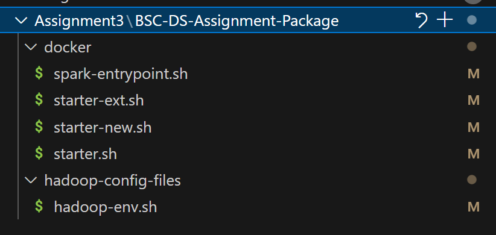
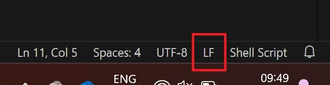

# Spark Cluster Using Docker

Recommendations for this repository:
- This document is easier to read of you use a preview tool in your IDE, [e.g. VS Code](https://itsfoss.com/vs-code-markdown-preview/).
- If you want to hand-in the assignment via GitHub, create a private fork of this repository as described in [Assignment1](https://learning.unisg.ch/courses/21277/assignments/77935).

## Task 1

### 1.1 Docker

Install Docker by following the instructions of the official documentation on
https://docs.docker.com/get-started/introduction/get-docker-desktop/. You can 
stop when you see the image shown
https://docs.docker.com/get-started/introduction/get-docker-desktop/#access-the-frontend in your Browser.

We will also create a custom Docker network. This network is used by Docker and local to the machine it is created on. All containers of the cluster as well as the host will connect to this network.

```bash
docker network create --gateway 172.23.0.1 --subnet 172.23.0.0/16 A3
```

> **IMPORTANT**
> All files in `BCS-DS-Assignment-Package` are synced between container and host disk. This will become relevant later on.

You might man to check the section `Live Demo` in the Appendix before proceeding.

### 1.2 Hadoop Distributed Filesystem (HDFS)

#### Required on Windows: Ensure line endings of the startup script

[Line endings on Windows and Unix are different.](https://stackoverflow.com/a/426404). Some files are mounted into the container and must be executable there. This is not possible, if the line endings do not match. To ensure that they do, open the folder that contains the assignment package in your IDE, e.g. in VS Code (see Figure 1). Check the line endings symbol and click on it _if it shows_ `CRLF` and set it to `LF`  (see Figure 2). Save all files.



_Figure 1:_ Files that need adjustment



_Figure 2:_ Symbol to toggle the line endings in VS Code

#### Start HDFS

Run the below command. Note that this will not start Spark.

```bash
docker compose -f docker-compose.hadoop.yaml up --force-recreate
```

_Note for advanced users_: bringing up the datanode can fail, if the cluster was started before. Hence `--force-recreate`.

#### Visit the HDFS WebUI

The following apps can now be visited:

- Hadoop Namenode: http://locahost:9870
  - Or http://namenode:9870 if DNS is configured or if you are in the container
- Hadoop Datanode: http://locahost:9864
  - Or http://datanode:9864 if DNS is configured or if you are in the container

#### Interact with the file system

On `http://localhost:9870`, in the upper right corner go to `Utilities->Browse the file system`. Use the Buttons `Create Directory`, `Upload Files`, `Cut & Paste` and `Parent Directory` to interact with the file system.

#### Stop

_Note:_ once you stop the containers, the files you uploaded are lost. At this point, you should not have valuable files there. If you do, download the file via the WebUI.

You have three options (at least):

1. In the terminal you started the containers, press `CTRL+C`
2. In the directory `BSC-DS-Assignment-Package`, open a terminal and run `docker compose -f docker-compose.hadoop.yaml down`
3. Use the Docker Desktop UI

### 1.3 Spark

#### Start HDFS & Spark

In the directory `BSC-DS-Assignment-Package`, open a terminal. The below command will start both HDFS and Spark

```bash
docker compose -f docker-compose.hadoop.yaml -f docker-compose.spark.yaml up --force-recreate
```

#### Visit the Spark WebUI

- Spark Master: http://localhost:8080
  - Or http://spark-master:8080 if DNS is configured or if you are in the container
- Spark History Server: http://localhost:18080/
  - Or http://spark-master:18080 if DNS is configured or if you are in the container

> _Note_:
> These UIs are for monitoring and inspection. They do not provide a feature to submit applications

#### Upload the required file to _HDFS_

Spark relies on HDFS to host all files relevant to the application. That includes `.jar` files that implement application, input files and output files. _Using local paths when submitting will not work_, not matter if you are using the host or a container.

1. Upload `BSC-DS-Assignment-Package/assets/spark-examples_2.12-3.5.3.jar` to HDFS `/jars`. The process is the same as in the section _Hadoop Distributed Filesystem (HDFS)_.
2. Attach to a container or prepare your host to submit applications to spark (see Appendix).
3. Submit the application. In below line adjust `10` with the number of iterations you prefer.
    ```bash
    # From container. See Appendix for more options
    spark-submit --deploy-mode cluster --class org.apache.spark.examples.SparkPi --master spark://spark-master:7077 hdfs://namenode:9000/jars/spark-examples_2.12-3.5.3.jar 10
    ```
4. Congratulations! You submitted your first job. Now use the WebUI at the beginning of this section to explore what has happened

### 1.4 Application

#### Submit a self-built application

1. Create your own input file for PageRank that mocks webpages that point to other webpages. Do not use the mocked URLs below but come up with your own e.g. using names of the group and course members. The file should have at least 5 entries, but don't go to crazy. The layout is as follows:
    ```txt
    http://www.ex1.org http://www.ex2.org
    http://www.ex2.org http://www.ex3.org
    ```
2. Upload the input file to `/input` via the HDFS WebUI
3. Run PageRank. The process essentially the same as before with the difference to build the application first and use an additional argument during submission:
    1. Attach to a container (see Appendix). We assume you have prepared your host by now, if you want you use it as spark client instead of a container. 
    2. In a terminal, change to the directory `BSC-DS-Assignment-Package/tasks`
    3. _First difference:_ run `./gradlew build` (or `.\gradlew build` if you chose to do this on a Windows host).
    4. Upload the jar file to HDFS `/jars`. The process is the same as in the section _Hadoop Distributed Filesystem (HDFS)_.
    5. _Second difference:_ submit the application. In below line, adjust `pages.txt` with the name you chose, adjust `10` with the number of iterations you prefer, and replace `namenode` with `localhost` if you chose to do this on the host.
        ```bash
        # From container. See Appendix for more options
        spark-submit --deploy-mode cluster --class com.assignment3.spark.Task1 --master spark://spark-master:7077 hdfs://namenode:9000/jars/app.jar hdfs://namenode:9000/input/pages.txt 10
        ```
    6. Congratulations! You submitted your self built application job. Now use the WebUI at the beginning of this section to explore what has happened

### Submit an application that writes files to HDFS


1. Change the code of PageRank so that it stores the result as a CSV file. You might want to make sure the output filename is unique or that outputs from potential previous runs are removed.
2. Run the process as in `Submit a self-built application` again from step 3.

### Finalize

By now you created three artifacts:
1. The input file
2. The modified source code
3. The output file in CSV

Make sure they are persistent. 1. and 2. are taken care of, if they are in `BCS-DS-Assignment-Package`. Download 3. via the HDFS WebUI.

## Task2: Count words using Count words using Resilient Distributed Datasets (RDD)

1. Follow the comments given in the [project template](tasks/app/src/main/java/com/assignment3/spark/Task2.java).
    - Your implementation might generate multiple output part files depending on the number of partitions Spark uses. Use output consolidation methods to consolidate your output into a single output file.
2. Store the output as file on HDFS/ and download from there.
3. Test the solution using the [provided test file](tasks/app/src/main/java/com/assignment3/spark/Task2Check.java) like this:
    ```txt
    root@spark-client:/app/tasks# ./gradlew run -PchooseMain=com.assignment3.spark.Task2Check --args="/app/output/output-task2.txt /app/output/output-task2-check.txt"

    > Task :app:run
    Both files are NOT the same!

    BUILD SUCCESSFUL in 706ms
    2 actionable tasks: 1 executed, 1 up-to-date
    root@spark-client:/app/tasks# ./gradlew run -PchooseMain=com.assignment3.spark.Task2Check --args="/app/output/output-task2.txt /app/output/output-task2-check.txt"

    > Task :app:run
    Both files are the same!

    BUILD SUCCESSFUL in 1s
    2 actionable tasks: 1 executed, 1 up-to-date
    root@spark-client:/app/tasks#
    ```

### Finalize

For this task you created two artifacts:
1. The source code of the Spark implementation of word count
2. The output file of the application

## Task3: Examine sustainability data using DataSet

1. Follow the comments given in the [project template](tasks/app/src/main/java/com/assignment3/spark/Task3.java).
    - Your implementation might generate multiple output part files depending on the number of partitions Spark uses. Use output consolidation methods to consolidate your output into a single output file.
2. Store the output as file on HDFS/ and download from there.

### Finalize

For this task you created two artifacts:
1. The source code that makes use of `DataSet` to aggregate GHG data
2. The output file of the application

## Task4: Get creative with the International Movie Database (IMDb)

Since you are free in this task to pick your goal with the limitation that the implementation must make use of Spark's features for optimizing the computation, there are no templates. If inspiration does not strike, you can use the [prepared data](input/imdb_top_1000.csv) to get you jump started. The CSV was stripped of the header for your convenience. This is there meaning on the of one movie:

|Series_Title|IMDb_Rating|Action|Adventure|Animation|Biography|Comedy|Crime|Drama|Family|Fantasy|Film-Noir|History|Horror|Music|Musical|Mystery|Romance|Sci-Fi|Sport|Thriller|War|Western|
|---|---|---|---|---|---|---|---|---|---|---|---|---|---|---|---|---|---|---|---|---|---|---|
|The Shawshank Redemption|9.3|0|0|0|0|0|0|1|0|0|0|0|0|0|0|0|0|0|0|0|0|0|
|The Godfather|9.2|0|0|0|0|0|1|1|0|0|0|0|0|0|0|0|0|0|0|0|0|0|

> The series with the title "The Shawshank Redemption" has and IMDb Rating of 9.3 and it is only tagged with genre "Drama".

> The series with the title "The Godfather" has and IMDb Rating of 9.2 and it is tagged with genre "Crime" and "Drama".

### Finalize

For this task you created three artifacts:
1. The input file for the application
2. The source code of your application
3. The output file of the application

## Appendix

### Live Demo

#### Docker

#### Run a Fist Container

The goal of the below instructions is to demonstrate how interact with containers

```bash
docker run hello-world
```

#### Interacting with a Container

```bash
# Do what the friendly stdout from the previous command says
docker run -it ubuntu bash

# In a new terminal, run another container
docker run -it ubuntu bash

# Take a look a Docker Desktop and/or run the following commands to see the container name
docker ps

# No need to attach, if only for one command
# With the above command, you can e.g. find the name of the container you started during the setup
# It is randomly generated, so it probably won't have the same name as in this README.
# Once you have the name, execute some commands _in_ the container,e.g. show the content of the current working directory
docker exec zealous_poincare ls 

# Run a container with a port
docker run -p 8080:80 docker/welcome-to-docker
```

Docker environments for applications that are:
- isolated
- lightweight
- ephemeral


#### Containers States

```bash
# Running. Did that already

# Paused
docker pause zealous_poincare

# stop the container
docker stop zealous_poincare
```

#### Docker Compose

Starting a container with multiple command line arguments and/or using multiple containers can become cumbersome quickly. Docker compose tackles this.

```yaml
services:
  welcome:
  image: docker/welcome-to-docker
  ports:
    - 8080:80
```

### Attach to A Running Container

You have to options:

#### CLI

```bash
docker exec -it spark-client bash -il
```


#### VS Code Remote Development extension pack

> Visual Studio Code Remote Development allows you to use a container, remote machine, or the Windows Subsystem for Linux (WSL) as a full-featured development environment.

Once installed and containers started, you can easily attach to `spark-client` by following the [official instructions](https://code.visualstudio.com/docs/devcontainers/attach-container#_attach-to-a-docker-container)

### Options to submit a job

With Docker Desktop, the host does not have access the container network. This impacts how you need to address the host.

```bash
# From container. Containers can resolve hostnames like spark-master, namenode, etc.
spark-submit --deploy-mode cluster --class org.apache.spark.examples.SparkPi --master spark://spark-master:7077 hdfs://namenode:9000/jars/spark-examples_2.12-3.5.3.jar 10

# From Docker host. The host does not know the hostnames. It must use its own ports
spark-submit --deploy-mode cluster --class org.apache.spark.examples.SparkPi --master spark://localhost:7077 hdfs://namenode:9000/jars/spark-examples_2.12-3.5.3.jar 10

# From host, delegating to container. This essentially behaves as the first one.
docker exec spark-client spark-submit --deploy-mode cluster --class org.apache.spark.examples.SparkPi --master spark://spark-master:7077 hdfs://namenode:9000/jars/spark-examples_2.12-3.5.3.jar 10
```

### Optional: Install JDK 17 and Spark 3.5.3

Everything you need to compile applications and submit applications to Spark is provided in the containers. However, if you prefer to use your native environment as Spark client, you will have to install JDK 17 and Spark 3.5.3 on the device you want to use.

1. Follow [this tutorial](https://www.geeksforgeeks.org/download-and-install-java-development-kit-jdk-on-windows-mac-and-linux/) to install JDK. Make sure you pick version 17.
2. Follow [the official instructions](https://spark.apache.org/downloads.html) to install Spark3.5.3. Pick `3.5.3 (Sep 24 2024)` and `Pre-built for Apache Hadoop 3.3 and later`.
3. Copy [hadoop-config-files/spark-defaults.conf](hadoop-config-files/spark-defaults.conf) to configuration directory of Spark, usually a directory `conf` in the installation directory of Spark.

> _Note:_
> Spark is built against the specified version of Hadoop but it does not provide the executables for Hadoop.
> You can install Hadoop on your devices but this _is not recommended_.
